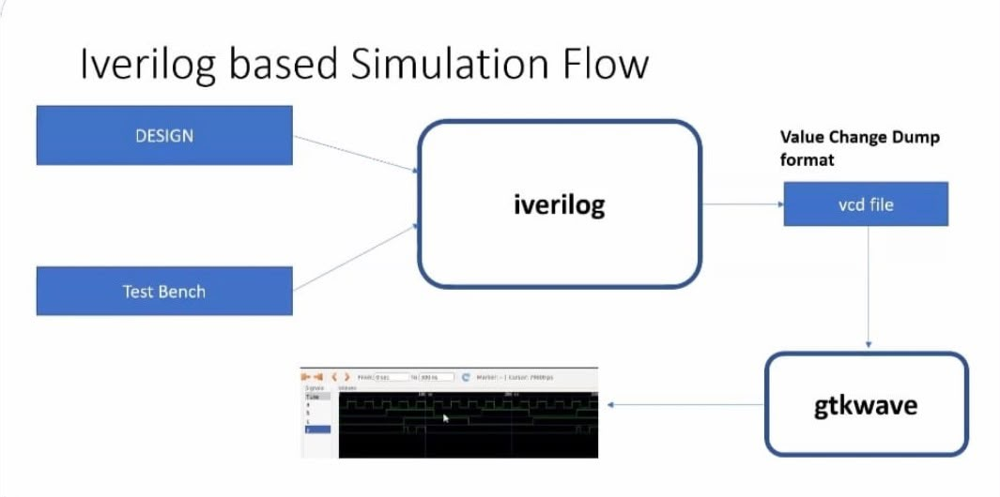
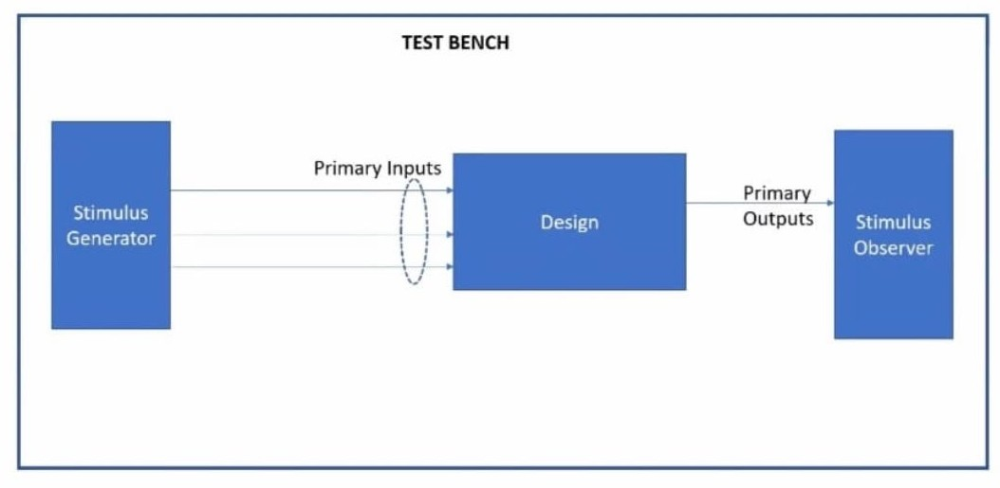
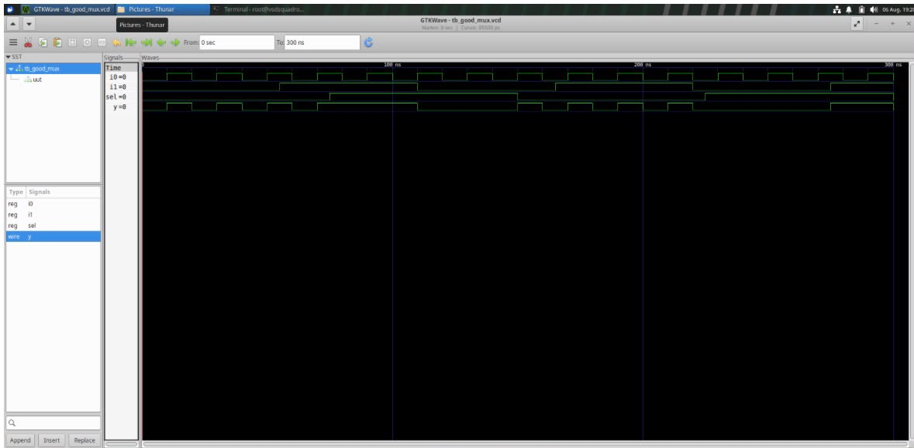

🟦 Day 1 — RTL Design Through Simulation

🎯 Objective

The objective of Day 1 is to understand the basic RTL design and simulation flow using open-source tools.

The complete flow is:

Verilog RTL → Icarus Verilog → Simulation → VCD → GTKWave

⸻

1️⃣ Introduction to RTL Design

RTL stands for Register Transfer Level.

Verilog HDL is used to describe the behavior and structure of digital hardware.

During this session, I learned how to:

* Write Verilog modules
* Define inputs and outputs
* Create testbenches
* Apply test inputs
* Simulate the design
* Analyze the output waveform

⸻

2️⃣ Icarus Verilog

Icarus Verilog is an open-source Verilog simulator.

Check the installation using:

iverilog -V

The following flow illustrates the basic journey of a Verilog design from RTL coding to simulation and waveform analysis.

This flow helped me understand how the RTL design, testbench, simulator and waveform viewer are connected during the simulation process.
⸻

3️⃣ Design and Testbench

A typical simulation contains two important parts:

Design

The actual hardware module.

Example:

mux.v

Testbench

The testbench provides inputs to the design and observes its outputs.

Example:

tb_mux.v

### 🧪 Testbench Structure

The following image shows the basic structure of a Verilog testbench used to verify the RTL design.

The testbench generates different input combinations and applies them to the design under test (DUT). It then observes the corresponding outputs to check whether the design is functioning as expected.

This practical helped me understand how a testbench is connected to the RTL design during simulation.

⸻

4️⃣ Compilation

The Verilog design and testbench are compiled using:

iverilog -o mux.vvp mux.v tb_mux.v

⸻

5️⃣ Simulation

Run the generated simulation file:

vvp mux.vvp

This generates the waveform file if $dumpfile and $dumpvars are included in the testbench.

Example:

mux.vcd

⸻

6️⃣ GTKWave

GTKWave is used to visually analyze the simulation waveform.

Open the waveform using:

gtkwave mux.vcd

The waveform helps us understand how the output changes according to the input signals.

⸻

7️⃣ Practical RTL Experiment

Example: 2:1 Multiplexer

The 2:1 multiplexer has:

* Two inputs
* One select line
* One output

The output depends on the select signal.

S = 0 → Y = A
S = 1 → Y = B

⸻

8️⃣ Simulation Result

After simulation, the waveform was analyzed using GTKWave.

⸻

🧠 What I Learned

* Basics of RTL design
* Verilog module structure
* Testbench creation
* Icarus Verilog simulation
* VCD waveform generation
* GTKWave waveform analysis

⸻

✅ Day 1 Conclusion

Day 1 helped me understand the basic RTL simulation flow:

Design → Testbench → Compile → Simulate → Waveform → Analyze
